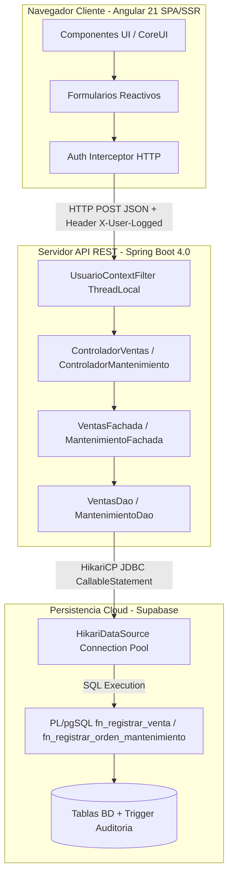
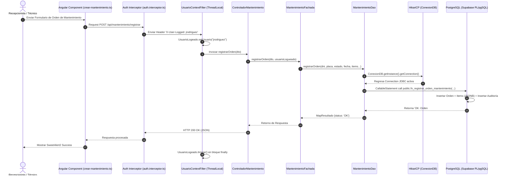

# Arquitectura del Sistema - Multiservicio Rafael

> **Documento de Especificación Arquitectónica, Patrones de Diseño y Flujo de Datos del Sistema Multiservicio Rafael.**

---

## 🏗️ 1. Descripción de la Arquitectura por Capas

El **Sistema Multiservicio Rafael** está diseñado bajo un modelo desacoplado cliente-servidor de n-capas (N-Tier Architecture), garantizando alta mantenibilidad, escalabilidad, concurrencia segura y separación estricta de responsabilidades (SRP - Single Responsibility Principle).

```
┌─────────────────────────────────────────────────────────────────────────┐
│                      CAPA DE PRESENTACIÓN (FRONTEND)                     │
│  ┌───────────────────────────────────────────────────────────────────┐  │
│  │  Angular 21 + CoreUI (Components, Standalone Views, Forms, SSR)   │  │
│  │  - src/app/sistema/ (ventas, mantenimiento, producto, cliente...) │  │
│  └───────────────────────────────────────────────────────────────────┘  │
└─────────────────────────────────────────────────────────────────────────┘
                                    ▲
                                    │ HTTP JSON / REST API + Auth Interceptor
                                    ▼
┌─────────────────────────────────────────────────────────────────────────┐
│                      CAPA CONTROLADORA (SPRING BOOT REST)               │
│  ┌───────────────────────────────────────────────────────────────────┐  │
│  │  REST Controllers (@RestController, @CrossOrigin, @RequestMapping)│  │
│  │  - multiservicioRafael.invenatario.controller.*                   │  │
│  └───────────────────────────────────────────────────────────────────┘  │
└─────────────────────────────────────────────────────────────────────────┘
                                    ▲
                                    │
                                    ▼
┌─────────────────────────────────────────────────────────────────────────┐
│                   CAPA DE FACHADA / NEGOCIO (FACADE)                    │
│  ┌───────────────────────────────────────────────────────────────────┐  │
│  │  Business Facades (Encapsulamiento de lógica y orquestación)     │  │
│  │  - multiservicioRafael.invenatario.facade.*                       │  │
│  └───────────────────────────────────────────────────────────────────┘  │
└─────────────────────────────────────────────────────────────────────────┘
                                    ▲
                                    │
                                    ▼
┌─────────────────────────────────────────────────────────────────────────┐
│                 CAPA DAO / ACCESO A DATOS (JDBC HIKARICP)                │
│  ┌───────────────────────────────────────────────────────────────────┐  │
│  │  Data Access Objects (*DaoInterface -> *Dao)                       │  │
│  │  - multiservicioRafael.invenatario.repository.*                   │  │
│  │  ThreadLocal Audit Filter (UsuarioLogeado)                        │  │
│  └───────────────────────────────────────────────────────────────────┘  │
└─────────────────────────────────────────────────────────────────────────┘
                                    ▲
                                    │ JDBC Connection Pool (HikariCP 5.1)
                                    ▼
┌─────────────────────────────────────────────────────────────────────────┐
│                 CAPA DE PERSISTENCIA (POSTGRESQL / SUPABASE)             │
│  ┌───────────────────────────────────────────────────────────────────┐  │
│  │  PostgreSQL Database + PL/pgSQL Stored Procedures                 │  │
│  │  - fn_registrar_venta, fn_registrar_orden_mantenimiento, etc.     │  │
│  └───────────────────────────────────────────────────────────────────┘  │
└─────────────────────────────────────────────────────────────────────────┘
```

---

## 🧩 2. Componentes de la Arquitectura

### 🔹 Capa de Presentación (Frontend Angular)
- **Vistas y Componentes**: Organizados modularmente dentro de `src/app/sistema/` (`ventas`, `mantenimiento`, `producto`, `compra`, `cliente`, `proveedor`, `trabajador`, `configuracion`, `auditoria`).
- **Guards de Enrutamiento (`auth.guard.ts`)**: Verifica el estado de autenticación y permisos antes de permitir el acceso a rutas protegidas mediante `CanActivate`.
- **Interceptores HTTP (`auth.interceptor.ts`)**: Intercepta automáticamente todas las peticiones salientes `HttpClient` inyectando encabezados como `X-User-Logged` y gestionando errores globales.

### 🔹 Capa de Control (Backend REST API)
- **Controladores Spring Boot (`multiservicioRafael.invenatario.controller`)**: Clases expuestas como `@RestController` (`ControladorVentas`, `ControladorMantenimiento`, `ControladorCliente`, `ControladorLogin`, `ControladorAuditoria`, etc.) que exponen contratos JSON estandarizados.
- **Filtro de Contexto de Auditoría (`UsuarioContextFilter`)**: Intercepta cada solicitud HTTP para extraer el usuario emisor (`X-User-Logged`) y almacenarlo de forma aislada en el hilo mediante `ThreadLocal`.

### 🔹 Capa de Fachada (Facade Layer)
- **Clases Facade (`multiservicioRafael.invenatario.facade`)**: Unifican y simplifican la ejecución de reglas de negocio para los controladores (`VentasFachada`, `MantenimientoFachada`, `ClienteFachada`, `AutenticacionFachada`, etc.).

### 🔹 Capa DAO y Conexiones (Repository Layer)
- **Interfaces y DAOs Concrete (`multiservicioRafael.invenatario.repository`)**: Interfaces segregadas (`VentasDaoInterface`, `MantenimientoDaoInterface`) implementadas por clases DAOs que interactúan directamente con la base de datos usando `CallableStatement` y `PreparedStatement`.
- **Pool HikariCP (`ConexionDB.java`)**: Patrón Singleton que administra las conexiones JDBC de alto rendimiento hacia PostgreSQL en Supabase.

---

## 🔄 3. Diagramas de Flujo y Secuencia

### Diagrama 1: Flujo de Arquitectura General del Sistema



---

### Diagrama 2: Secuencia de Transacción con Auditoría ThreadLocal



---

## 🛠️ 4. Patrones de Diseño Implementados

### 1. **Model-View-Controller (MVC)**
- **Model**: Entidades y DTOs Java (`Categoria`, `Cliente`, `Marca`, `Producto`, `Proveedor`, `Servicio`, `Trabajador`, `Usuario`).
- **View**: Vistas Standalone de Angular compuestas con plantillas HTML5, CoreUI Angular y estilos Vanilla CSS.
- **Controller**: Controladores REST Java Spring Boot (`ControladorVentas`, `ControladorMantenimiento`, `ControladorProducto`, `ControladorCliente`).

### 2. **Data Access Object (DAO)**
- Separación de la lógica de persistencia a través de contratos bien definidos (`VentasDaoInterface`, `ClienteDaoInterface`, `CompraDaoInterface`) e implementaciones concretas (`VentasDao`, `ClienteDao`, `CompraDao`) que aíslan las llamadas SQL y procedimientos `CallableStatement`.

### 3. **Facade Pattern (Fachada)**
- Clases Facade (`AutenticacionFachada`, `VentasFachada`, `MantenimientoFachada`, `ProductoFachada`, `ClienteFachada`) que consolidan transacciones complejas, validaciones previas y orquestación de servicios para ofrecer una interfaz simplificada a los controladores REST.

### 4. **Singleton Pattern**
- Implementado en `ConexionDB.java` para garantizar una instancia única centralizada de `HikariDataSource`, optimizando el reuso de recursos del pool de conexiones a la base de datos.

### 5. **ThreadLocal Context Filter (Auditoría)**
- Implementado mediante `UsuarioContextFilter.java` y `UsuarioLogeado.java`. Garantiza el aislamiento por hilo (Thread-safe) del usuario que realiza cada operación HTTP, permitiendo que la auditoría registre exactamente quién ejecutó cada cambio sin modificar la firma de todos los métodos.

### 6. **Interceptor & Guard Pattern (Frontend)**
- `auth.guard.ts`: Proporciona seguridad declarativa en las rutas Angular previniendo accesos no autorizados.
- `auth.interceptor.ts`: Inyecta encabezados HTTP globales y maneja códigos de error (401, 403, 500) uniformemente.

### 7. **Strategy / Helper Pattern**
- `ConsultaDNI.java` y `ConsultaRuc.java`: Clases especializadas en la consulta y consumo de apis externas de validación de identidad en Perú (RENIEC / SUNAT).
- `ExportadorService.java`: Servicio especializado en la estrategia de generación de documentos en PDF (OpenPDF) y Excel (Apache POI).

---
*Especificación de arquitectura oficial para el proyecto Multiservicio Rafael.*
